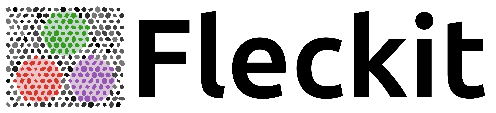
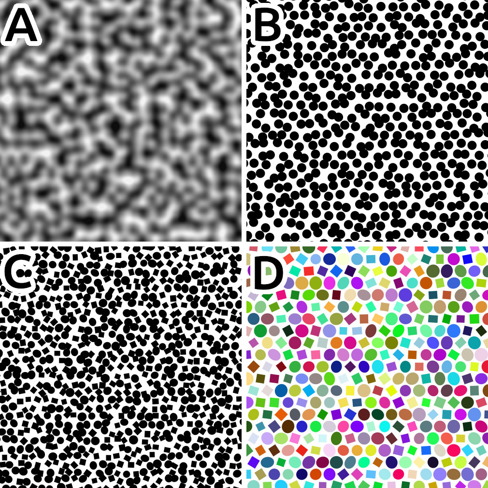

[](https://doi.org/10.5281/zenodo.17517624) 

  

# About Fleckit
Julia code to generate speckled images for digital image correlation studies. The image below shows the speckle types currently supported. Image A shows Perlin noise based speckling, which is a pixelated image containing continuous gray scales. Image B, C, and D show speckles created as polygons in an `.svg` image description. 

  
# Installation
```julia
julia> ]
(@v1.xx) pkg> add https://github.com/COMODO-research/Fleckit.jl.git
```

# Getting started
To get started install the package, study the documentation, and test some of the demos provided in the [`examples`](https://github.com/COMODO-research/Fleckit.jl/tree/main/examples) folder. 

